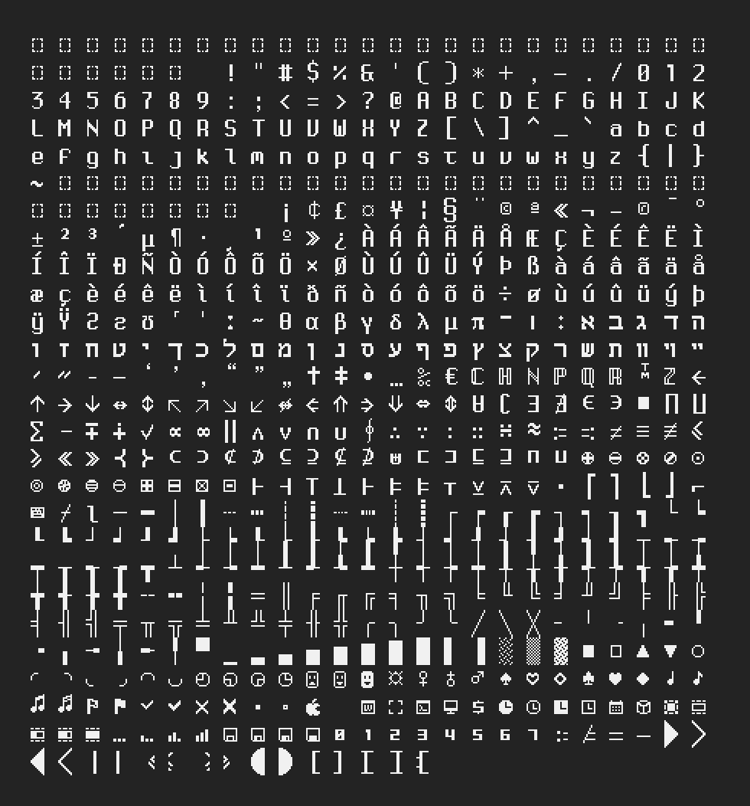

# [cursed_font](https://tilde.team/~kiedtl/projects/cursed/)


See the GitHub releases section and grab a tarball. Extract, copy the
`font.bdf` file someplace, and run `fc-cache -f -v`.



## FAQ

- What's up with the edgy name?
```
 <kiedtl> I think I'm more-or-less done with this font, except for some
          powerline glyphs & accented characters maybe
 <kiedtl> any feedback/advice would be appreciated, I'm not a talented font
          designer :^)
<meff-m-> kiedtl: oh no that picture looks a bit cursed
 <kiedtl> meff-m-: the cursed font. I like it.
<meff-m-> :)
```

## Known issues

- Certain symbols are mildly unreadable.
  - `U+21d4`, `U+21D5`, `U+21AE`
- Certain symbols are somewhat unconventional and may be difficult
  to recognize.
  - Math symbols
- Many missing glyphs that I'd like to eventually add.
  - Hebrew vowels.
  - Rest of Greek alphabet.

## License

This font and other non-code content (i.e. screenshots) are licensed under
**CC-BY v4.0**. Everything else (Lua scripts) are licensed under the
Unlicense.
